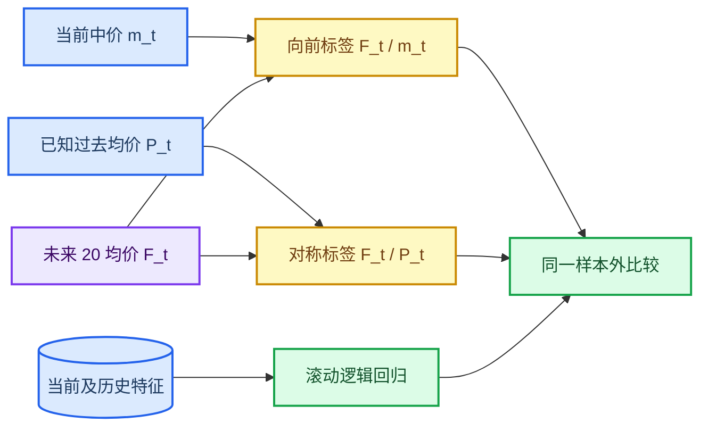

# HK 07709：方向标签定义与样本外预测研究

*截至 2026-08-31；使用 7 月容错 MBO 重建后的 20 个完整日，检验“对称路径”与“未来相对当前”两种方向标签是否产生不同的预测结论。*

---

## 📌 摘要

你的担心得到了实证支持。旧的模型标签比较“未来 20 个 snapshot 均价”与“过去 20 个 snapshot 均价”；而特征已经包含当前相对过去 1/2/5/10/20/50/100 个 snapshot 的价格路径。这不是看到未来的 look-ahead leakage，但标签的分母包含模型已知的过去信息，使任务部分变成对已发生趋势的分类。

在完全相同的 19 个日样本外测试日、1,981,257 个样本、25 维因果特征、滚动五日训练和训练期阐值下：

| 标签 | 加权 Accuracy | 加权平衡 Accuracy | 加权 Macro-F1 | 每日平均置信差 |
|---|---:|---:|---:|---:|
| 旧：过去 20 均价 → 未来 20 均价 | **59.98%** | 58.49% | **58.04%** | 0.434 |
| 新：当前中价 → 未来 20 均价 | **39.11%** | 37.70% | **36.33%** | 0.071 |
| 差值（新−旧） | −20.86 pp | −20.79 pp | −21.71 pp | −0.364 |

不训练任何模型，只使用在时点 `t` 已知的“当前中价相对过去 20 均价”，就能达到旧标签 **58.58% Accuracy**，与逻辑回归的 59.98% 非常接近。这个只依赖过去的代理变量与旧标签的日均相关系数为 **0.689**。因此，旧的约 60% 准确率不应解读为“对未来价格方向有 60% 预测能力”。

## 🔍 研究问题与标签定义

本研究回答两个问题：

1. 保持模型、特征、样本和滚动训练完全一致时，仅修正标签基准，预测指标会变化多少？
2. 旧标签的高 Accuracy 在多大程度上能被当前已观测到的过去趋势解释？

设 `m_t` 为当前中价，`h=20`，未来均价为 `F_t = mean(m_(t+1), …, m_(t+h))`，过去均价为 `P_t = mean(m_(t-h+1), …, m_t)`。两种标签的连续收益定义是：

```text
对称路径（旧）: r_sym(t) = F_t / P_t - 1
真正向前（新）: r_fwd(t) = F_t / m_t - 1
```

每个标签都在对应训练窗口内，用 `|r|` 的 33.33% 分位数生成上/平/下三类。因此两个问题的类别比例几乎一致，不是因为新标签有更多“平”而导致 Accuracy 降低。



## 🧬 实验方法

### 数据和时序

- 使用容错 MBO 重建后的 20 个完整交易日。07-02 前 70% 拟合，后 30% 仅作初始验证；之后 19 日是完整日样本外测试。
- 每个测试日的模型最多使用此日之前 5 个完成交易日训练。
- 两种标签使用完全同一批合格时点、同一 100-snapshot 历史输入窗口、同一 25 维因果特征、同一个 class-balanced multinomial logistic regression。
- 断线前后的 segment 不交叉；特征窗口与 20-snapshot 未来均价都不跨越断点。

### 诊断基准

对旧标签另外报告一个不训练的代理变量：`m_t / P_t - 1`。它没有使用任何未来价格，只是当前已知的过去 20 个 snapshot 趋势。如果它对 `r_sym` 有很高解释力，则高准确率主要来自标签和可观测历史的重叠，而不是对未来的高强度预测。

## 📊 发现

### 新标签下的准确率大幅降低

两个任务的真实类别分布几乎相同：

| 标签 | 下跌 | 平 | 上涨 | 最多数类基线 |
|---|---:|---:|---:|---:|
| 对称路径 | 34.87% | 31.87% | 33.26% | 34.87% |
| 真正向前 | 34.66% | 31.81% | 33.53% | 34.66% |

对称路径任务的 Accuracy 在每个测试日都在 58.55%–65.65%之间；真正向前任务则只有 35.92%–43.91%。类别不平衡不足以解释此差异：新标签的 39.11% 仍高于 34.66% 的最多数类基线，但 Macro-F1 只有 36.33%，表明对三类的测别能力很弱。

### 旧标签几乎可被已知趋势复现

| 对旧对称标签的评估方式 | Accuracy | Macro-F1 | 含义 |
|---|---:|---:|---|
| 滚动逻辑回归（全部 25 维特征） | 59.98% | 58.04% | 当前的旧模型结果 |
| 已知过去 20 趋势的单代理变量 | 58.58% | 58.47% | 不需训练，不看未来 |

代理变量与旧标签连续回报的日均相关系数为 0.689。也就是说，旧模型相对这个最简单的已知趋势代理变量只多了 1.40 个百分点的 Accuracy。

### 与做市结果的对应

旧报告中 `p(up)-p(down)` 形成 drift 的方向模型，使用的正是对称路径标签。因此，已完成的 AS、GP-style 和 drift 收益回测仍然是按旧模型生成的正确历史记录，但**不应再用其方向 Accuracy 作为对未来价格可预测性的证据**。

新的向前标签模型在本轮只做了预测比较，未重新调参、未替换 drift 后重做做市 PnL。这样将“标签效应”与“策略参数效应”分开，避免在同一次比较中混入两个变量。

## 💡 解读与建议

结论不是“方向模型完全没信息”。真正向前标签的 Accuracy 仍比最多数类基线高 4.44 个百分点，但这个弱 edge 还不足以支持现有 drift 的经济解释。

下一轮建议按如下顺序推进：

1. 用 `forward_current_to_future20` 替换 drift 模型的训练标签，保持策略后端和费用假设不变，重新做 19 日的 AS+drift 与 drift+库存配对消融。
2. 把评估从三类 Accuracy 扩展为“条件净 maker edge”：分买卖侧的预期 half-spread、markout、费用、成交率和库存处置成本。
3. 同时报告 `t+20` 终点中价相对 `t` 的标签作为稳健性检查，区分“未来路径均值”与“未来终点价格”两种经济目标。
4. 不再将 59.98% 作为对未来方向的主结果对外汇报；主结果应以 39.11% / 36.33% 为当前同口径基线。

## ✅ 复现与核验

新增的 `forward_returns` 已单元测试：它只使用当前中价与之后 20 个 snapshot 的均价，且不跨越 segment。全部测试现为 **23 项通过**。研究结果还通过了以下检查：

- 两种标签的每日合格样本数完全一致
- 每个测试日的训练日都早于测试日
- Accuracy、balanced Accuracy 和 Macro-F1 都在合法区间

## 🔗 结果索引

- [方向标签比较机器结果](../0824/output/july_2026_tolerant_direction_label_comparison_results.json)
- [方向标签比较日级结果](../0824/output/july_2026_tolerant_direction_label_comparison_daily.csv)
- [可复现研究脚本](../0824/run_direction_label_study.py)
- [新标签函数](../0824/run_experiment.py)
- [原月度策略复测报告](7709_202607_策略实验汇总报告.md)

本研究是回测标签诊断，不构成投资建议。
