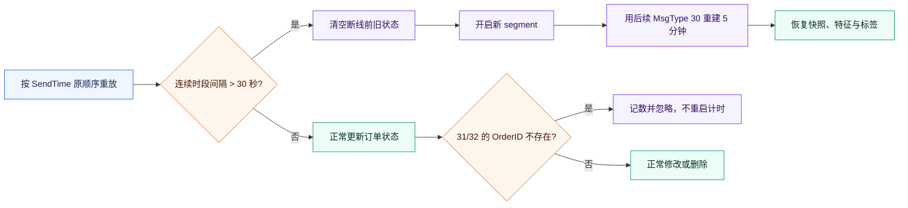

# HK 07709：2026 年 7 月容错重建与做市策略复测报告

*截至 2026-08-31；本版用“断线后清空旧状态、由新增订单重建 5 分钟、忽略未知 OrderID 的 31/32”口径重做全月回测，取代先前只含 11 个严格可用日的版本。*

---

## 📌 执行摘要

新口径下不再是 11 天。全月 25 个 CSV 中，现在有 **20 个完整可用交易日**：07-02 只用于初始训练/校准，之后 **19 天进入完整日样本外 PnL**。旧报告中的“11 天”是严格状态机口径，已被本报告替换。

主结论有四条：

1. **经典 AS 仍是最强基线，但扩展样本后结论明显变弱。** 保守 `through` 口径下，全费用净 PnL 为 **−HKD 19,956.65**，19 天中 5 天盈利；乐观 `touch` 口径为 **+HKD 10,403.10**，11/19 天盈利。收益符号仍取决于排队成交假设。
2. **AS+drift 没有稳健提升。** 最干净的 `AS + unit drift`在 `through` 下比 AS 少 **HKD 2,025.17**，在 `touch` 下只多 **HKD 304.24**；联合调参与 kill switch 都没有改善保守结果。
3. **旧的 drift+库存“提升很明显”仍然存在，但只是对弱基线的减亏。** 原始 drift+库存+kill switch 在 `through` 下比传统无信号基线改善 **HKD 17,064.36**，但自身仍亏 **HKD 166,898.50**，并且比经典 AS 少 **HKD 146,941.85**。
4. **旧方向 Accuracy 约 60%，但不是纯粹的未来价格预测。** 旧对称路径标签的 19 个测试日加权 Accuracy 为 **59.98%**、Macro-F1 为 **58.04%**，但用“未来 20 均价相对当前中价”的正向标签后，指标降至 **39.11% / 36.33%**。详见[方向标签定义研究](7709_202607_方向标签定义研究.md)；未来项应以新标签训练 drift，而不再把旧 Accuracy 解读为强度未来方向 edge。

| 主判断口径：`through` | 全费用净 PnL | 盈利日 | 净 PnL/计费周转 | 日收盘最大回撤 |
|---|---:|---:|---:|---:|
| 经典 AS | **−19,956.65** | **5/19** | **−0.871 bp** | 27,884.49 |
| AS + unit drift | −21,981.82 | 5/19 | −0.936 bp | 29,808.12 |
| AS + tuned drift | −27,425.43 | 3/19 | −1.130 bp | 28,619.04 |
| AS + drift kill switch | −26,603.83 | 4/19 | −1.111 bp | 28,125.18 |
| GP-style | −180,317.13 | 0/19 | −4.336 bp | 180,317.13 |
| 强制 drift + 库存 | −166,380.02 | 1/19 | −3.746 bp | 166,380.02 |
| 原始 drift + 库存 + kill switch | −166,898.50 | 0/19 | −3.963 bp | 166,898.50 |

## 🧱 断线容错和订单簿重建

本次采用的是我们刚确认的规则：



具体约束是：

- 只有新的连续时段时间断点会触发重置；阈值为 30 秒。
- 断点后立即丢弃旧订单状态，因为缺失期间未收到的删除/修改会留下“幽灵订单”。
- 后续新增订单（MsgType 30）正常进入新状态；重建期固定 5 分钟，期间不输出回测快照。
- 未知 OrderID 的修改/删除（MsgType 31/32）只记数并忽略，不污染整日，也不重启 5 分钟计时。
- 断点前后分属不同 segment；100 步特征窗口和未来标签都不允许跨越断点。
- 重复新增、订单方向冲突、负数量或 SendTime 倒序等其他不可能状态仍然会标记污染，不做猜测修复。

### 实际触发情况

| 审计项 | 结果 |
|---|---:|
| 发现的 CSV | 25 |
| 能生成快照的日期 | 22 |
| 有断点的日期 | 10 |
| 检测到的断点 | 34 |
| 断线缺失时间合计 | 151.26 分钟 |
| 5 分钟恢复窗内抑制的变更组 | 550,102 |
| 忽略的未知 OrderID 删除 | 60,936 |
| 忽略的未知 OrderID 修改 | 5,222 |
| 通过开收盘覆盖与状态检查的日期 | **20** |

新增恢复的 9 个完整日是：`07-03, 07-06, 07-08, 07-10, 07-14, 07-16, 07-17, 07-22, 07-24`。

完整可用日为：

`07-02, 07-03, 07-06, 07-07, 07-08, 07-09, 07-10, 07-14, 07-15, 07-16, 07-17, 07-20, 07-21, 07-22, 07-23, 07-24, 07-27, 07-28, 07-29, 07-30`

### 为什么还不是 22 个交易日

- **07-13** 共识别 6 次断点，但另有 1 次 SendTime 倒序。这不属于已授权忽略的 31/32，所以仍按严格原则排除。
- **07-31** 没有出现大于 30 秒的 SendTime 断点，因此不能按“断线重建”规则自动重置；09:34:38 之后出现 85,198 次交叉/锁定快照候选，有效覆盖无法延续到收盘，所以排除。
- `07-12, 07-25, 07-26` 是周末微型文件，无法形成连续交易时段。

因此，这里的“整月”表示已审计全部 25 个文件，并对 19 个合格的后续交易日计算 PnL；不是强行给数据仍不可证的 07-13 和 07-31 填补收益。

## 🧠 特征、训练与 drift 时序

这个实验不是“每天只用前一天训练”，也不是在当天收盘后倒回去预测当天。准确时序是：

- 每个样本的 25 维特征只使用当时及之前的订单簿/价格路径，不看未来。
- 07-02 前 70% 用于初始拟合，后 30% 只做初始校准和参数选择，不计入 PnL。
- 预测某个测试日时，逻辑回归使用该日之前最近最多 5 个已完成的可用日滚动训练。
- drift 先由 `p(up)-p(down)` 构造，再用之前已完成的样本外区间线性校准为未来 20 个快照的预期中价变动（tick）。
- 参数验证最多看之前 5 个已完成区间；原始 kill switch 只看紧邻的上一个已完成样本外区间。
- 所有滚动训练、校准和调参均已通过无未来数据检查。

简言之：**特征是当时可见的因果特征；模型由前面最多 5 个交易日滚动训练，不是固定只靠前一天。**

## 📊 月度策略结果

### AS、GP-style 与强制 drift

| 成交口径 | 策略 | 零费用毛 PnL | 全费用净 PnL | 盈利日 | 净 PnL/周转 |
|---|---|---:|---:|---:|---:|
| through | 经典 AS | +43,516.00 | **−19,956.65** | 5/19 | **−0.871 bp** |
| through | GP-style | −65,122.00 | −180,317.13 | 0/19 | −4.336 bp |
| through | 强制 drift + 库存 | −43,342.00 | −166,380.02 | 1/19 | −3.746 bp |
| through | 配对关闭信号 | −63,406.00 | −179,396.50 | 0/19 | −4.284 bp |
| touch | 经典 AS | +99,244.00 | **+10,403.10** | 11/19 | **+0.324 bp** |
| touch | GP-style | +31,903.00 | −127,791.09 | 3/19 | −2.217 bp |
| touch | 强制 drift + 库存 | +57,772.00 | −105,371.76 | 5/19 | −1.789 bp |
| touch | 配对关闭信号 | +34,165.00 | −126,808.59 | 4/19 | −2.182 bp |

强制 drift 相对配对无信号版在 `through` 下改善 **HKD 13,016.49**，在 `touch` 下改善 **HKD 21,436.84**。这证明方向项确实减少了一部分坏成交，但策略的换手和费用仍远超过它的 edge。

### 原始 drift+库存 kill switch

| 成交口径 | 传统无信号基线 | drift+库存+开关 | 配对关闭信号 | 相对传统基线 |
|---|---:|---:|---:|---:|
| through | −183,962.86 | **−166,898.50** | −187,976.98 | **+17,064.36** |
| touch | −131,426.53 | **−109,880.58** | −134,509.84 | **+21,545.95** |

alpha 在 18/19 个测试日开启，只在 07-22 关闭。它相对配对无信号版的改善更大：`through` **+HKD 21,078.48**、`touch` **+HKD 24,629.25**。然而与经典 AS 相比，仍分别落后 HKD 146,941.85 和 HKD 120,283.69。

### AS+drift

AS+drift 只在经典 AS 的 reservation price 中加入校准方向项：

```text
reservation_price
  = mid
  + eta * calibrated_alpha
  - inventory_lots * gamma * horizon_variance
```

| 成交口径 | 模型 | 全费用净 PnL | 盈利日 | 相对经典 AS |
|---|---|---:|---:|---:|
| through | 经典 AS | **−19,956.65** | 5/19 | — |
| through | AS + unit drift | −21,981.82 | 5/19 | −2,025.17 |
| through | AS + tuned drift | −27,425.43 | 3/19 | −7,468.79 |
| through | tuned 参数、关闭 drift | −27,939.13 | 5/19 | −7,982.48 |
| through | AS + drift kill switch | −26,603.83 | 4/19 | −6,647.18 |
| touch | 经典 AS | +10,403.10 | 11/19 | — |
| touch | AS + unit drift | **+10,707.35** | 11/19 | **+304.24** |
| touch | AS + tuned drift | +8,856.17 | 10/19 | −1,546.93 |
| touch | tuned 参数、关闭 drift | +1,620.47 | 10/19 | −8,782.63 |
| touch | AS + drift kill switch | +8,344.81 | 11/19 | −2,058.29 |

`AS + unit drift` 使用与经典 AS 完全相同的参数，只把校准预期价格移动加一次（`eta=1`），因此是“AS+drift 到底有没有用”的最干净检验。结果在保守口径下略差，乐观口径下略好，量级都不足以证明稳健增量。

## 🔎 与旧的 11 天结果对比

| 指标 | 严格旧口径 | 容错新口径 | 变化 |
|---|---:|---:|---:|
| 完整可用日（含初始日） | 11 | **20** | +9 |
| 计入 PnL 的样本外日 | 10 | **19** | +9 |
| 方向 Accuracy | 59.81% | **59.98%** | +0.17 pp |
| 方向 Macro-F1 | 57.01% | **58.04%** | +1.02 pp |
| AS `through` 净 PnL | −1,029.57 | **−19,956.65** | −18,927.08 |
| AS `through` 每日平均 | −102.96 | **−1,050.35** | −947.39 |
| AS `through` 净收益/周转 | −0.108 bp | **−0.871 bp** | −0.763 bp |
| AS `touch` 净 PnL | +12,879.76 | **+10,403.10** | −2,476.66 |
| AS `touch` 净收益/周转 | +0.917 bp | **+0.324 bp** | −0.593 bp |

这个对比说明，旧版 AS 在 `through` 下“接近盈亏平衡”很大程度上受到严格数据筛选的影响。恢复 9 个断线日后，预测精度没有下降，但经济结果明显变差；这更像一个原先存在日期选择偏差的样本扩展，而不是 drift 模型突然失效。

同时，新口径也不是无偏真值。它依赖“5 分钟新增订单已足以近似恢复当前深度”这一经验假设；没有同时点的全量快照时，无法数学上证明汇总深度已精确恢复。

## ✅ 核验与局限

本次新增了容错状态机与合成断点测试，当前 **21 项单元测试全部通过**。三组月度实验的时序、费用/成交/库存记账、月度汇总重算、日末平仓、配对消融与开收盘覆盖检查均通过。

尚未解决的局限包括：

- `touch/through` 只是不同的排队成交敏感性口径，没有虚拟订单的真实 queue-ahead。
- 未计市场冲击、真实下单/撤单确认延迟、券商最低佣金、借券可得性和融券成本。
- 每边 2.77 bp 是沿用的固定研究假设（官方固定费 1.27 bp + 券商佣金假设 1.50 bp），不等于用户实际账户费率。
- GP-style 是离散 tick/库存的实用近似，不是 Guilbaud–Pham 原论文 QVI 的数值解。
- AS+drift 的候选网格和 alpha 设计源于前期实验，本次是展期复测，不是从未见过的策略发现集。

## 🧭 决策建议

当前仍建议以**经典 AS 作为唯一主基线**，但应将其预期从“接近盈亏平衡”下调为“保守成交口径下小幅负 edge”。`AS + unit drift` 可保留为配对研究分支，不建议上线强制 drift、联合调参 drift 或当前 kill switch。

下一轮优先级是：

1. 对 07-13 的 SendTime 倒序与 07-31 的长时间交叉盘做数据源级排查，不扩大容错规则来强行纳入。
2. 获取定时全量订单簿快照，用它验证“重建 3–5 分钟”后的价格与深度误差，再决定恢复窗是固定 5 分钟还是按品种自适应。
3. 把方向模型的目标从 Accuracy 改为分买卖侧的条件净 maker edge：半点差减费用、预期 markout 与库存处置成本。
4. 在真实 queue-ahead 或队列耗尽模型上重做 AS 与 `AS + unit drift`，并冻结最后一周作为从未参与调参的终测集。

## 📁 结果索引

- [容错 AS、GP-style 与强制 drift 机器结果](../0824/output/july_2026_tolerant_as_gp_drift_results.json)
- [容错 AS、GP-style 与强制 drift 日级结果](../0824/output/july_2026_tolerant_as_gp_drift_daily.csv)
- [容错原始 drift+库存 kill switch 机器结果](../0824/output/july_2026_tolerant_directional_kill_switch_results.json)
- [容错原始 drift+库存 kill switch 日级结果](../0824/output/july_2026_tolerant_directional_kill_switch_daily.csv)
- [容错 AS+drift 机器结果](../0824/output/july_2026_tolerant_as_drift_results.json)
- [容错 AS+drift 日级结果](../0824/output/july_2026_tolerant_as_drift_daily.csv)
- [方向标签定义与预测研究](7709_202607_方向标签定义研究.md)
- [盘口容错重建程序](../0824/lob_reconstruction.py)
- [容错重建单元测试](../0824/tests/test_reconstruction.py)
- [月度 AS/GP/drift 主程序](../0824/run_july_month_strategy.py)
- [月度原始 kill switch 程序](../0824/run_july_month_kill_switch.py)
- [月度 AS+drift 程序](../0824/run_july_month_as_drift.py)
- [配套高频做市模型文献综述](高频做市模型文献综述.md)

本报告是研究回测，不构成投资建议，也不代表在真实排队、延迟、冲击、借券和账户费率下可复制。
