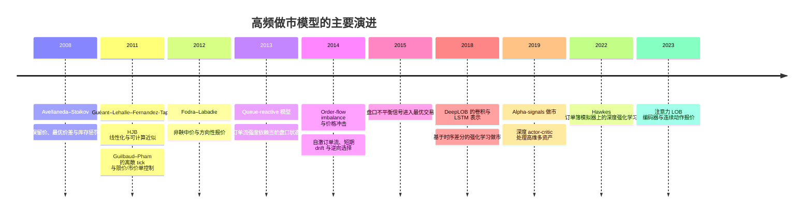
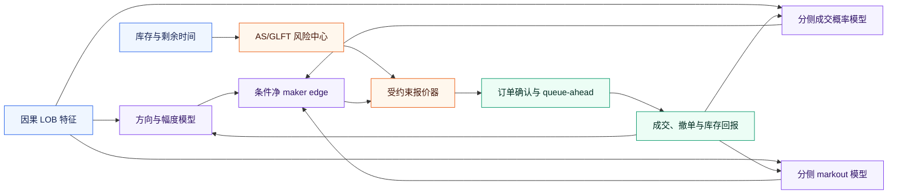

# 高频限价订单簿做市模型：从库存控制到方向信号与深度强化学习

*面向 HK 07709 实验的叙述性文献综述；检索与核对截至 2026-08-31，重点覆盖连续时间控制、离散订单簿、方向 alpha、逆向选择、深度学习和强化学习。*

---

## 📌 摘要

高频做市的核心不是单独预测价格，而是在每次报价时同时权衡四件事：可捕获的买卖价差、被信息型订单“挑中”的逆向选择、库存暴露，以及成交与费用。经典 Avellaneda–Stoikov（AS）把这个问题写成风险敏感的随机控制；Guéant–Lehalle–Fernandez-Tapia 改善了求解与近似；Guilbaud–Pham（GP）进一步引入离散 tick、随机点差、限价/市价单和执行优先级。[^1][^2][^3]

后续文献逐渐把非鞅价格、订单流不平衡、短期 alpha 和状态依赖成交强度纳入报价。其共同结论不是“有方向信号就应把报价平移”，而是：alpha 必须与库存、成交概率和逆向选择联合校准；信号的经济幅度必须大于它带来的额外坏成交与交易成本。[^4][^5][^6]

这与 07709 的实证结果一致。经典 AS 已接近盈亏平衡，`AS + unit drift` 只产生极小且不稳健的增量；放大或联合调参的 drift 反而恶化。此前 drift+库存相对 GP-style 基线的明显提升，更适合解释为“减少一个高换手弱基线的坏成交”，而不是方向模型已经创造稳定做市 alpha。

本文引用的项目数字与实验定义详见[07709 七月策略实验汇总报告](7709_202607_策略实验汇总报告.md)。

## 🗺️ 文献演进

*下图按时间概括研究主线：2008 年从库存风险控制出发，2011—2015 年扩展到可计算近似、离散订单簿、方向信号与队列状态，2018 年以后引入深度表示学习和强化学习。*



## 🧮 经典库存控制框架

### Avellaneda–Stoikov

AS 假设中间价扩散、买卖限价单的成交到达强度随报价距离指数衰减，并以指数效用惩罚库存风险。其最有影响力的表达是保留价和总 spread：[^1]

```text
reservation_price = mid - inventory * gamma * variance_to_horizon

total_spread = gamma * variance_to_horizon
             + 2 / gamma * log(1 + gamma / order_decay)
```

`inventory > 0` 时保留价下移，卖价更容易成交、买价更不积极；临近交易结束时剩余风险期限缩短。模型把“库存控制”和“赚价差”放进同一个优化目标，因而非常适合作为做市基准。

它的局限也直接关系到回测偏差：中间价与订单到达过程被高度简化；成交强度通常只依赖距中间价的距离；真实 tick、队列优先级、盘口状态、延迟、冲击和时变 alpha 不在基础模型内。AS 是强基线，不是生产系统的完整描述。

### Guéant–Lehalle–Fernandez-Tapia

Guéant、Lehalle 与 Fernandez-Tapia 将库存约束下的 HJB 系统转换为线性常微分方程系统，并给出闭式或谱近似，使 AS 类控制在更大库存状态空间中更易求解。[^2] 这条研究线的贡献主要是**可计算性与边界控制**：它没有取消模型风险，而是让参数、库存上限和报价之间的关系更透明。

对当前项目的启示是：库存惩罚不应只实现为一个随意的 tick 偏移；应该以明确目标函数、终端库存成本和成交强度估计共同决定。否则“GP-style”或“库存 skew”只能算启发式近似。

### Guilbaud–Pham

Guilbaud–Pham 把 spread 建模为有限状态 Markov 链，允许做市商连续提交限价单、在离散时点使用市价单，并通过规则/脉冲混合控制与准变分不等式处理库存和执行优先级。[^3] 这比基础 AS 更贴近离散订单簿，特别适合研究：

- tick 较大、spread 只有少数离散状态的品种；
- 限价单与市价单处置库存的联合选择；
- 队列优先级对成交与收益的影响；
- 终端库存或盘中硬限制。

但完整 GP 是动态规划问题。当前 07709 的 `GP-style` 只保留离散 tick、库存偏移、硬上限和日末平仓，没有数值求解原论文 QVI。其月度亏损不能被解释为“GP 理论无效”，只能说明**当前近似实现与参数选择**在这批数据和费用下表现较差。

## 🧭 方向信号如何进入做市

### 非鞅中价与方向性保留价

Fodra–Labadie 将 AS/Guéant 类模型扩展到一般非鞅中价过程，并显式允许方向性下注：预期价格上涨时，报价可以让买单更易成交、卖单更保守，同时用终端库存惩罚约束风险。[^4] 这给 `AS+drift` 提供了理论依据：

```text
reservation_price
  = mid
  + eta * expected_future_move
  - inventory * gamma * variance_to_horizon
```

但这个式子只说明方向项应如何进入中心价，并不保证任意预测器、任意 `eta` 都能提高 PnL。若 `expected_future_move` 校准偏大、衰减太快或只在某一侧有效，方向平移会增加被动成交的不对称性与尾部库存。

### 订单流、短期 drift 与逆向选择

Cont、Kukanov 与 Stoikov 在 50 只美国股票上发现，短区间价格变化与最佳买卖价处的 order-flow imbalance 近似线性相关，斜率与市场深度成反比。[^7] 这支持使用盘口不平衡预测短期方向，但也意味着同样的信号在深度、波动和 tick 状态变化后必须重新缩放。

Cartea、Jaimungal 与 Ricci 用自激订单流和短期价格漂移刻画高频交易者如何在赚 spread、预测订单流与规避逆向选择之间权衡。[^5] Cartea、Donnelly 与 Jaimungal 进一步把 LOB volume imbalance 放入最优交易，并在独立样本外区间报告利润改善，机制包括减少逆向选择以及在有利价格移动前调整限价单位置。[^6]

Cartea 与 Wang 的 alpha-signal 模型更直接：做市商利用市场单带来的短暂动量和新闻驱动的潜在 alpha，既规避坏成交，也进行方向交易和库存管理；更高风险容忍度会增加方向利润，同时带来更多投机性市价单与往返交易。[^8] 这说明 alpha 的效果不能只看报价中心，还应观察：

- 信号是否降低买、卖两侧的成交后 adverse markout；
- 信号是否改变成交频率与库存分布；
- 增量毛 edge 是否覆盖额外费用和主动平仓；
- 风险容忍度变化是否只是把均值换成更厚的尾部。

### 对 07709 的解释

07709 的方向分类约 60%，但验证期 score 与未来实际 tick 变化相关仅 0.040 和 0.015；直接吃单在点差后每笔为负。这表明信号能区分许多“小幅正确方向”，却不能稳定估计可兑现幅度。

`AS + unit drift` 在 `through` 下相对 AS 为 −HKD 240，在 `touch` 下为 +HKD 184，正是弱经济幅度的表现。联合调参把 `eta` 与库存参数一起选，会在很少的验证日上追逐噪声；样本外比配对 `eta=0` 版本少约 HKD 5,186—6,313。文献支持方向性做市，但也支持当前更保守的结论：**需要预测的是条件净 maker edge，不只是未来涨跌类别。**

## 🧱 成交、队列与逆向选择

### 状态依赖订单流

Huang、Lehalle 与 Rosenbaum 的 queue-reactive 模型把中间价不变期间的 LOB 视为 Markov 排队系统，让限价、成交与撤单强度依赖当前盘口状态；该模型既可用于模拟，也可用于复杂算法的交易成本分析。[^9] 相比只用“报价距中间价”解释成交的 AS 强度，queue-reactive 思路更适合真实高频回测。

这类模型提示至少要对以下状态分层估计：spread、bid/ask queue size、order-flow imbalance、时间段、波动率、自己的 queue-ahead 和近期撤单率。只有观察到市场在挂单价成交，并不能证明自己的订单已经排到队首。

### 为什么成交模型能改变收益符号

当前实验的 `touch` 与 `through` 分别是乐观和保守代理。经典 AS 的月度全费用 PnL 从 `through` 的 −HKD 1,029.57 变为 `touch` 的 +HKD 12,879.76，差异远大于 `AS+unit drift` 的增量。也就是说，当前最主要的不确定性不是 alpha 系数的小数点，而是**是否真的成交以及成交后发生什么**。

Lalor 与 Swishchuk 的研究专门比较 fill probability 与 adverse fills，指出把价格与市场单过程独立模拟可能明显夸大短周期策略收益，并主张在历史仿真中显式追踪不利成交。[^10] 这与本项目的经验完全一致：在没有真实队列回报时，`touch` 只能当上界，`through` 也只能当较保守代理。

### Maker PnL 的正确分解

评价方向信号时，建议把每笔被动成交拆成：

```text
net_maker_edge
  = captured_half_spread
  - adverse_selection_markout
  - fees_and_rebates
  - expected_inventory_liquidation_cost
  - expected_market_impact
```

其中 markout 必须分买单、卖单和 5/10/20 秒 horizon。07709 的方向增强在 8 个“日期 × 买卖侧”的 20 秒组合中有 6 个改善，但另外 2 个卖单组合恶化，短 horizon 还会换符号。这说明将两侧合并为一个平均值会隐藏模型失效的具体方向。

## 🧠 深度学习预测器

DeepLOB 用卷积提取订单簿空间结构，用 LSTM 表示时间依赖，并在公开基准和伦敦证券交易所数据上报告跨品种样本外表现。[^11] Sirignano 与 Cont 在数十亿条订单簿事件上发现，跨股票联合训练的深度模型可以提取具有一定普适性的价格形成特征。[^12]

这些工作证明 LOB 中存在可学习结构，但没有消除三层落差：

1. **统计泛化：** 高度重叠窗口会夸大有效样本量；日内随机切分不能替代按完整交易日 walk-forward。
2. **概率校准：** 分类概率需要映射为预期价格幅度、持续时间和置信区间。
3. **执行兑现：** 即使方向正确，点差、费用、排队失败和逆向选择仍可能使净 PnL 为负。

07709 的初版 DeepLOB 训练 Macro-F1 94.01%、测试 32.37%，而 25 维因果逻辑回归达到 60.94%，说明当前数据量下模型容量过大。深度模型应保留为后续候选，但在有数周连续日和冻结测试周以前，简单、可解释、易校准的模型更适合作为 alpha 模块。

## 🤖 强化学习做市

Spooner 等人构建高保真 LOB 模拟器，用时序差分学习和定制奖励控制库存风险，展示了 RL 做市相对若干基线的改进。[^13] Guéant 与 Manziuk 则以 model-based actor-critic-like 方法和深度网络近似多资产 AS 类问题的最优报价，重点解决公司债做市的高维状态空间。[^14]

更近期工作把多变量 Hawkes 订单簿模拟器与深度 RL 控制器结合，或直接用卷积和注意力从 LOB 构造状态、输出连续报价动作。[^15][^16] RL 的吸引力在于它能联合学习报价、库存和长期回报；其主要风险也恰好在同一处：策略会利用模拟器、奖励函数和成交规则中的任何偏差。

对当前项目而言，直接升级到 RL 不是优先级最高的下一步。没有真实 queue-ahead、确认延迟和稳定多日数据时，RL 很可能学会利用 `touch` 之类的仿真假设。更合理的顺序是先校准可检验的成交/markout 环境，再让 RL 在 AS 或 GP 的受约束动作空间内学习小幅残差。

## 🧩 模型比较与适用场景

| 模型族 | 核心状态 | 库存控制 | 方向 alpha | 成交建模 | 07709 当前适用性 |
|---|---|---|---|---|---|
| AS | 中价、波动、库存、时间 | 解析式保留价 | 基础版无 | 距离驱动 Poisson | **最强主基线**，但需升级成交强度 |
| GLFT | AS 类状态与库存网格 | HJB/ODE 与近似 | 可扩展 | 强度模型 | 适合规范化库存与终端成本 |
| 完整 GP | spread 状态、库存、订单动作 | 规则/脉冲控制 | 可扩展 | tick、限价/市价单、优先级 | 理论相关，但当前实现不是完整 GP |
| 非鞅 AS / alpha-signal | AS 状态 + 预期价格移动 | 与方向联合 | 显式 | 依赖具体扩展 | 对应 AS+drift；需严格限制与校准 `eta` |
| Queue-reactive | 多档队列状态 | 需外接控制层 | 可由状态产生 | 状态依赖强度 | **最急需补充的执行模块** |
| DeepLOB + 控制器 | 高维 LOB 历史 | 外接 AS/GP/RL | 数据驱动 | 通常另建 | 数据增多后再评估；当前线性模型更稳 |
| RL/深度 RL | LOB、库存、时间、成交历史 | 奖励与策略共同学习 | 隐式或显式 | 完全依赖环境 | 暂不宜直接上线，先修真实成交环境 |

## 🔬 面向下一轮实验的研究框架

### 推荐的模块化结构



这套结构刻意不让分类器直接决定买卖。方向模型只贡献预期幅度；成交概率模型回答能否轮到自己；markout 模型回答成交是否有毒；AS/GLFT 层负责库存和终端风险；报价器只在预期净 maker edge 为正且库存约束允许时挂单。

### 建议的验证协议

1. 使用同一数据口径收集至少 20 个连续交易日，滚动 5 日训练、1 日验证、1 日测试，并把最后一周完全冻结。
2. 所有超参数、`eta`、kill switch、库存上限和概率阈值只能由历史验证日选择。
3. 以日为重采样单位报告 bootstrap 置信区间；高度重叠的逐快照样本不能当作独立观测。
4. 主目标使用费用后的净 PnL 与最大回撤，同时报告 turnover、库存时长、尾部库存和主动平仓成本。
5. 对每个候选同时报告 `touch`、queue model 和 `through`；若三者结论不同，策略状态应是“不确定”。
6. `AS+drift` 的第一轮只测试固定小 `eta` 网格，并要求相对同参数 `eta=0` 的配对增量在多数日、买卖两侧和多个 markout horizon 上同向。

## ✅ 综述结论

文献支持把方向信号加入做市，但并不支持把分类准确率直接乘到 AS 保留价上。成熟做市系统的最小闭环应包含：库存风险、状态依赖成交、分侧逆向选择、费用/冲击和时间一致的样本外验证。

对 07709，最合理的研究路线是：

- 以经典 AS 为主基线；
- 用 queue-reactive 或经验 hazard 模型替换 `touch/through` 的粗糙成交判定；
- 把现有方向分类器改为未来幅度与分侧 markout 的条件模型；
- 仅把经过配对验证的小幅 alpha 残差加入 AS；
- 等真实成交环境稳定后，再研究完整 GP 数值解或受约束 RL。

因此，当前 AS+drift 的失败不是方向性做市理论被否定，而是一个重要的实证诊断：**信号强度、成交机制和逆向选择尚未被共同识别；在此之前，增加模型复杂度更可能增加过拟合，而不是增加可兑现收益。**

[^1]: Marco Avellaneda and Sasha Stoikov, “High-frequency trading in a limit order book,” *Quantitative Finance* 8(3), 2008, pp. 217–224. https://math.nyu.edu/inmemoriam/avellaneda/HighFrequencyTrading.pdf
[^2]: Olivier Guéant, Charles-Albert Lehalle, and Joaquin Fernandez-Tapia, “Dealing with the Inventory Risk: A Solution to the Market Making Problem,” 2011. https://arxiv.org/abs/1105.3115
[^3]: Fabien Guilbaud and Huyên Pham, “Optimal High Frequency Trading with Limit and Market Orders,” 2011. https://arxiv.org/abs/1106.5040
[^4]: Pietro Fodra and Mauricio Labadie, “High-frequency Market-making with Inventory Constraints and Directional Bets,” 2012. https://arxiv.org/abs/1206.4810
[^5]: Álvaro Cartea, Sebastian Jaimungal, and Jason Ricci, “Buy Low, Sell High: A High Frequency Trading Perspective,” *SIAM Journal on Financial Mathematics* 5(1), 2014, pp. 415–444. https://papers.ssrn.com/sol3/papers.cfm?abstract_id=1964781
[^6]: Álvaro Cartea, Ryan Francis Donnelly, and Sebastian Jaimungal, “Enhancing Trading Strategies with Order Book Signals,” 2015. https://papers.ssrn.com/sol3/papers.cfm?abstract_id=2668277
[^7]: Rama Cont, Arseniy Kukanov, and Sasha Stoikov, “The Price Impact of Order Book Events,” *Journal of Financial Econometrics* 12(1), 2014, pp. 47–88. https://arxiv.org/abs/1011.6402
[^8]: Álvaro Cartea and Yixuan Wang, “Market Making with Alpha Signals,” 2019. https://papers.ssrn.com/sol3/papers.cfm?abstract_id=3439440
[^9]: Weibing Huang, Charles-Albert Lehalle, and Mathieu Rosenbaum, “Simulating and Analyzing Order Book Data: The Queue-reactive Model,” 2013/2014. https://arxiv.org/abs/1312.0563
[^10]: Luca Lalor and Anatoliy V. Swishchuk, “Market Simulation under Adverse Selection,” 2024/2025. https://papers.ssrn.com/sol3/papers.cfm?abstract_id=4961447
[^11]: Zihao Zhang, Stefan Zohren, and Stephen Roberts, “DeepLOB: Deep Convolutional Neural Networks for Limit Order Books,” *IEEE Transactions on Signal Processing* 67(11), 2019. https://arxiv.org/abs/1808.03668
[^12]: Justin Sirignano and Rama Cont, “Universal Features of Price Formation in Financial Markets: Perspectives from Deep Learning,” 2018. https://arxiv.org/abs/1803.06917
[^13]: Thomas Spooner, John Fearnley, Rahul Savani, and Andreas Koukorinis, “Market Making via Reinforcement Learning,” AAMAS 2018. https://arxiv.org/abs/1804.04216
[^14]: Olivier Guéant and Iuliia Manziuk, “Deep Reinforcement Learning for Market Making in Corporate Bonds: Beating the Curse of Dimensionality,” 2019. https://arxiv.org/abs/1910.13205
[^15]: Bruno Gašperov and Zvonko Kostanjčar, “Deep Reinforcement Learning for Market Making Under a Hawkes Process-Based Limit Order Book Model,” 2022. https://arxiv.org/abs/2207.09951
[^16]: Hong Guo, Jianwu Lin, and Fanlin Huang, “Market Making with Deep Reinforcement Learning from Limit Order Books,” 2023. https://arxiv.org/abs/2305.15821
