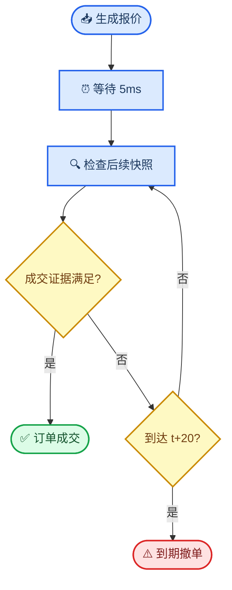

# 0906 成交逻辑实验报告

_HK 07709 · 2026 年 7 月样本外回测 · 2026-09-06_

---

## 📋 技术结论

**新规则确实更容易成交，但新增成交的质量较差，所以利润下降并不矛盾。** 固定原经典 AS 每日参数、只替换成交证据时：

- `through` 新增 202 笔成交，净 PnL 减少 HKD 1,435.84。
- `touch` 新增 238 笔成交，净 PnL 减少 HKD 1,104.07。
- 两种口径都只有 4/19 天改善、15/19 天变差。

完整 walk-forward 按新成交规则重估参数后，经典 AS 的 `through` 净 PnL 为 **HKD −21,085.97**，`touch` 为 **HKD +9,539.36**，分别比旧成交逻辑低 HKD 1,129.32 和 HKD 863.74。

**参数口径仍需进一步解耦。** `k` 应随成交逻辑变化；`alpha`、`calibrated_alpha` 和 `sigma²` 应仅由严格因果对齐的 trade-price 路径决定。当前 0906 结果只完成了成交生命周期改造，仍沿用旧版 L1 中价计算 `alpha/sigma²`，因此还不是 trade-price-only 的最终回测。

## 🎯 实验范围

- 标的：HK 07709。
- 数据期：2026 年 7 月。
- 07-02 用于初始训练与校准；随后 19 个合格交易日进入完整日样本外 PnL。
- 每边全包费用：2.77 bp，其中官方固定费 1.27 bp、券商佣金假设 1.50 bp。
- 报价有效期：20 个 snapshot。
- 下单延迟：5ms。
- 最小价位：HKD 0.02。

固定参数诊断用于隔离“成交规则本身”的影响；完整 walk-forward 结果则包含新规则下成交强度估计和历史参数选择的变化。两组结果回答的问题不同，不能混为一个因果对比。

## ⚙️ 订单生命周期与成交规则

在 snapshot `t` 产生报价后：

1. 订单在 `t` 的时间戳加 5ms 后生效。
2. 只检查同一交易时段内的 `t+1 ... t+20`，不使用 `t` 当下的成交或盘口作为证据。
3. 买单在 `bid quote >= future best ask` **或** `bid quote >= future trade price` 时成交。
4. 卖单在 `ask quote <= future best bid` **或** `ask quote <= future trade price` 时成交。
5. `touch` 允许价格相等；`through` 要求在满足方向上再穿过一个 tick。
6. 两类证据任一先满足即成交；检查完 `t+20` 仍未成交则撤单。



每一侧订单必须满足：

```text
报价数 = 成交数 + 到期撤单数
```

## 🔍 固定参数配对实验：成交增加但边际收益为负

本实验固定旧版经典 AS 每日参数，仅把成交证据从“未来 trade price”改为“未来 trade price 或对手方 L1 best quote”。

| 口径 | 旧成交数 | 新成交数 | 新增成交 | 净 PnL 变化 |
|---|---:|---:|---:|---:|
| **through** | 34,544 | 34,746 | +202 | **−1,435.84** |
| **touch** | 50,401 | 50,639 | +238 | **−1,104.07** |

新规则的成交证据构成如下；占比分母为该口径的全部新规则成交：

| 口径 | 全部成交 | Trade price 笔数（占比） | Best quote 笔数（占比） | Best ask | Best bid |
|---|---:|---:|---:|---:|---:|
| **through** | 34,746 | 33,461（96.30%） | 1,285（3.70%） | 647 | 638 |
| **touch** | 50,639 | 48,677（96.13%） | 1,962（3.87%） | 1,038 | 924 |

| 口径 | 毛 PnL 变化 | 新增费用 | 净 PnL 变化 |
|---|---:|---:|---:|
| **through** | −1,012.00 | +423.84 | **−1,435.84** |
| **touch** | −630.00 | +474.07 | **−1,104.07** |

新增成交并非免费增加成交量：

| 口径 | 每笔新增成交的毛 PnL 变化 | 每笔新增费用 | 每笔新增成交的净变化 |
|---|---:|---:|---:|
| **through** | −5.01 | +2.10 | **−7.11** |
| **touch** | −2.65 | +1.99 | **−4.64** |

结果说明，best quote 条件补进来的成交更容易伴随不利价格移动。成交概率提高只代表执行机会增加，不代表点差收益和成交后的 markout 为正；额外手续费又进一步降低净收益。

## 📊 完整 walk-forward：重估参数没有逆转结论

| 口径 | 旧成交逻辑经典 AS 净 PnL | 新成交逻辑经典 AS 净 PnL | 变化 |
|---|---:|---:|---:|
| **through** | −19,956.65 | **−21,085.97** | −1,129.32 |
| **touch** | +10,403.10 | **+9,539.36** | −863.74 |

完整新逻辑下各策略的月度结果为：

| 口径 | 策略 | 毛 PnL | 全费用净 PnL | 盈利日 |
|---|---|---:|---:|---:|
| **through** | 经典 AS | +42,386.00 | **−21,085.97** | 4/19 |
| **through** | GP-style | −65,462.00 | −181,448.82 | 0/19 |
| **through** | 强制 directional | −43,826.00 | −167,589.08 | 1/19 |
| **through** | 配对关闭信号 | −64,046.00 | −180,826.22 | 0/19 |
| **touch** | 经典 AS | +98,114.00 | **+9,539.36** | 11/19 |
| **touch** | GP-style | +32,493.00 | −128,140.59 | 3/19 |
| **touch** | 强制 directional | +58,506.00 | −105,631.14 | 5/19 |
| **touch** | 配对关闭信号 | +35,061.00 | −126,842.41 | 4/19 |

| 口径 | 策略 | Maker 成交数 | 到期撤单数 |
|---|---|---:|---:|
| **through** | 经典 AS | 34,425 | 155,387 |
| **through** | GP-style | 56,934 | 120,321 |
| **through** | 强制 directional | 60,873 | 112,722 |
| **through** | 配对关闭信号 | 57,469 | 122,677 |
| **touch** | 经典 AS | 50,036 | 139,737 |
| **touch** | GP-style | 81,262 | 96,589 |
| **touch** | 强制 directional | 83,685 | 92,710 |
| **touch** | 配对关闭信号 | 82,139 | 98,481 |

按“最早触发成交的证据”对每笔 maker 成交做互斥归类后，成交价是主要
证据；best quote 占比仅为 3.63%–6.38%。买单的盘口证据为 `best ask`，
卖单的盘口证据为 `best bid`。如果两类证据的时间戳相同，按现有选择
规则归入 best quote。

| 口径 | 策略 | 全部成交 | Trade price 笔数（占比） | Best quote 笔数（占比） | Best ask | Best bid |
|---|---|---:|---:|---:|---:|---:|
| **through** | 经典 AS | 34,425 | 33,175（96.37%） | 1,250（3.63%） | 636 | 614 |
| **through** | GP-style | 56,934 | 54,488（95.70%） | 2,446（4.30%） | 1,202 | 1,244 |
| **through** | 强制 directional | 60,873 | 57,561（94.56%） | 3,312（5.44%） | 1,672 | 1,640 |
| **through** | 配对关闭信号 | 57,469 | 55,012（95.72%） | 2,457（4.28%） | 1,204 | 1,253 |
| **touch** | 经典 AS | 50,036 | 48,124（96.18%） | 1,912（3.82%） | 1,022 | 890 |
| **touch** | GP-style | 81,262 | 77,515（95.39%） | 3,747（4.61%） | 1,957 | 1,790 |
| **touch** | 强制 directional | 83,685 | 78,346（93.62%） | 5,339（6.38%） | 2,736 | 2,603 |
| **touch** | 配对关闭信号 | 82,139 | 78,377（95.42%） | 3,762（4.58%） | 1,956 | 1,806 |

参数重估缩小了经典 AS 相对固定参数配对实验的损失，但没有改变方向：新成交证据带来的额外成交总体没有覆盖更差的毛收益与手续费。

## 🔗 参数与成交逻辑的边界

价格预测参数和执行参数应分层：

| 参数 | 当前来源 | 与成交逻辑的关系 | 下一版目标口径 |
|---|---|---|---|
| `alpha`（标签阈值） | L1 中价收益绝对值的分位数 | 不直接相关 | trade-price 收益绝对值的分位数 |
| `calibrated_alpha` | 模型分数对未来 20 snapshot 中价变化的校准 | 不直接相关 | 对未来 20 snapshot trade-price 变化的校准 |
| `sigma²` / `horizon_variance_ticks2` | 未来 20 snapshot 中价变化的方差 | 不直接相关 | 同期 trade-price 变化的方差 |
| `k` / `order_decay_per_tick` | 不同报价距离下的模拟成交率 | **直接相关** | 按实际成交规则重新估计 |
| `gamma`、库存上限、报价距离、`eta` | 历史验证 PnL 与回撤 | **间接相关** | 可在新规则下重调，但不得反向改变 `alpha/sigma²` 样本 |

因此，成交规则改变可以直接影响成交数、`k`、费用和 PnL，也可能间接影响通过回测选择的风险与报价参数；它不应改变由市场成交价路径独立估计的 `alpha` 和 `sigma²`。

## 📚 下一版 trade-price-only 定义

对 snapshot `t`，使用同一交易时段内、时间戳不晚于该 snapshot 的最近一笔成交价：

```text
trade_price[t]
  = last trade price with trade_time <= snapshot_time[t]

future_trade_move_ticks[t]
  = (trade_price[t+20] - trade_price[t]) / tick_size

sigma²
  = Var(future_trade_move_ticks)
```

因果对齐需要遵守三个边界：

- 不得使用 snapshot 之后的成交向前填充，否则会产生未来数据泄漏。
- 午间休市等交易时段边界不得跨段继承成交价。
- 时段开始后尚无历史成交的 snapshot 不参与参数估计。

尚需在重跑前确定成交价最大陈旧时间：如果很长时间没有新成交，是继续沿用最近成交价，还是删除超过阈值的样本。这个选择会影响有效样本数、标签分布和 `sigma²`。

## ✅ 核验与限制

已通过的机器核验包括：

- 旧模拟结果可由固定参数诊断程序复现。
- `净 PnL 变化 = 毛 PnL 变化 − 新增费用`。
- 训练、校准和调参不存在未来日期输入。
- 月度汇总可由日级结果重算。
- 所有测试日最终仓位归零。
- 每侧报价均能归入成交或到期撤单。
- 每日、每策略及每口径均满足 `maker_fills = trade_price_fills + best_quote_fills`。

本实验仍是可执行性代理，不是交易所撮合回放。数据没有虚拟订单的 queue-ahead、隐藏流动性、下单和撤单确认，因此 best quote 达到报价不能证明真实订单一定成交。结果也未计市场冲击、借券成本和券商最低佣金。

## ✍️ 下一步

1. 将标签阈值、方向幅度校准和 20-snapshot 方差统一切换到严格因果的 as-of trade-price 序列。
2. 保持本报告的订单生命周期不变，重新估计 `k` 并完成全量 walk-forward。
3. 单独输出 best-quote-only 与 trade-price 触发成交的 20-snapshot markout 分布，验证逆向选择来源。
4. 在完全相同的 `alpha/sigma²` 输入下重做固定参数配对，确保利润差异只来自成交证据。

## 🔗 文件索引

- [成交逻辑实现](directional_market_maker.py)
- [完整 walk-forward 程序](run_book_fill_experiment.py)
- [固定参数诊断程序](analyze_fill_logic_delta.py)
- [成交逻辑单元测试](tests/test_book_fill_execution.py)
- [固定参数成交逻辑诊断](output/fill_logic_diagnostic.json)
- [完整 walk-forward 机器结果](output/july_2026_tolerant_as_gp_drift_results.json)
- [完整 walk-forward 日级结果](output/july_2026_tolerant_as_gp_drift_daily.csv)
- [机器验证结果](output/july_2026_tolerant_as_gp_drift_validation.json)
