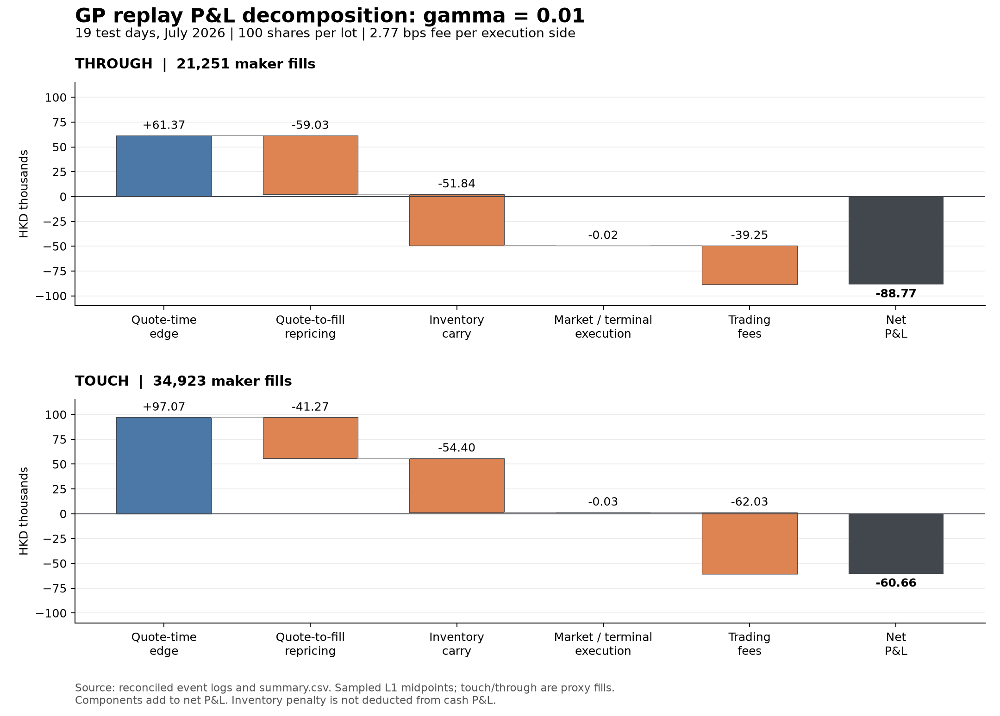
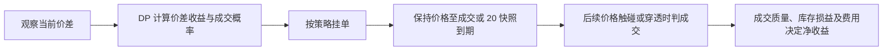

# GP 回测亏损诊断

_2026-09-17 · 19 个测试交易日 · 历史盘口代理回放_

---

本次重新回放 5 个 gamma × 2 个成交口径 × 19 天，共 190 组；新增日志不改变报价、成交或现金流。
主要发现：默认 gamma=5 的毛收益不足以覆盖费用；低 gamma 在 through 下还存在显著的报价到成交的不利移动和库存持有亏损。
这些结果支持当前策略与成交环境不匹配，不能推断所有做市策略普遍亏损，更不能从单月结果估计行业亏损概率。

## 📊 毛收益与费用

| gamma | 成交口径 | 毛收益 HKD | 费用 HKD | 净收益 HKD | 盈利日/19 |
|---:|---|---:|---:|---:|---:|
| 5 | through | 468.00 | 704.94 | -236.94 | 8 |
| 5 | touch | 565.98 | 4,396.92 | -3,830.95 | 7 |
| 0.1 | through | -24,364.24 | 20,935.77 | -45,300.01 | 0 |
| 0.1 | touch | 3,815.51 | 58,622.58 | -54,807.07 | 0 |
| 0.01 | through | -49,524.42 | 39,246.92 | -88,771.35 | 0 |
| 0.01 | touch | 1,369.46 | 62,027.33 | -60,657.87 | 0 |
| 0.001 | through | -73,307.45 | 43,516.03 | -116,823.48 | 0 |
| 0.001 | touch | -10,445.54 | 64,264.16 | -74,709.70 | 2 |
| 0 | through | -93,547.47 | 45,592.41 | -139,139.88 | 1 |
| 0 | touch | -30,380.55 | 66,652.04 | -97,032.59 | 2 |

来源：[summary.csv](summary.csv)。净收益为现金毛收益减费用；gamma 的库存惩罚没有从净收益中扣除。
费用固定为代码假设的单边 2.77bp，包括 1.27bp 固定费用与 1.50bp 经纪费用；不是本次独立核实的实际账户费率。
固定交易路径只去掉全部费用时，gamma=0.01/through 仍亏 49,524.42 HKD；touch 毛收益为 +1,369.46 HKD。
固定路径只保留代码的 1.27bp 费用时，两者净收益分别为 -67,518.50、-27,069.06 HKD。这里没有按新费率重新优化策略。

## 🔬 逐笔损益拆解



取 gamma=0.01/through，拆解如下：

| 分项 | HKD |
|---|---:|
| 成交挂单相对报价时中间价的优势 | +61,365.28 |
| 报价到成交期间的中间价变化 | -59,029.56 |
| 已有库存持有期间的中间价变化 | -51,840.15 |
| 盘中市价单相对中间价的成交损益 | -1.00 |
| 日终平仓相对中间价的成交损益 | -19.00 |
| 交易费用 | -39,246.92 |
| 净收益 | -88,771.35 |

上述各项严格相加等于现金净收益。报价时优势是相对当时中间价的账面距离，不是实际已实现收益，也不是已验证的条件期望。
报价到成交的不利移动抵消了报价时优势的 96.2%。
逐笔中间价使用成交时间之前最近一条快照。分解会随选用的标记价格改变，但总现金损益不变。
成交事件 CSV.gz 见 [events](events/)，每条含报价中间价、成交价、成交时可见中间价、库存和费用。

以买入为正，事件成交数量为 Δq，成交前库存为 q，中间价为 m、成交价为 p，单笔数量单位为 100 股：

```text
毛损益 = Σ 100·Δq·(m_event − p) + Σ 100·q_before·(m_event − m_previous_event)
限价成交项 = Σ 100·Δq·(m_quote − p) + Σ 100·Δq·(m_event − m_quote)
净损益 = 毛损益 − 费用（每日初始及终止库存均为零）
```

## 📉 成交后的价格证据

成交后 markout 定义为：买单 (未来中间价−成交价)×100；卖单 (成交价−未来中间价)×100。
它用于观察成交质量，不能再加到上面的损益拆解中，否则会重复计量。

| 口径 | 目标间隔 秒 | 样本成交数 | 平均毛 markout/笔 HKD | 扣单次成交费后 HKD |
|---|---:|---:|---:|---:|
| through | 1 | 20,924 | -2.014 | -3.856 |
| through | 3 | 20,903 | -2.065 | -3.907 |
| through | 10 | 20,872 | -2.033 | -3.874 |
| through | 30 | 20,788 | -2.245 | -4.084 |
| touch | 1 | 34,374 | +0.201 | -1.571 |
| touch | 3 | 34,280 | +0.158 | -1.614 |
| touch | 10 | 34,269 | +0.151 | -1.620 |
| touch | 30 | 34,160 | +0.049 | -1.722 |

取目标时间之后第一条、同交易段且晚到不超过 1 秒的快照；剔除成交时可见中间价已陈旧超过 1 秒的样本。
上表没有计未来平仓的手续费或跨价差成本。来源：[markouts.csv](markouts.csv)。

gamma=0.01/through 的 3 秒毛 markout 在 19 个测试日全部为负；买单平均 -2.335 HKD，卖单 -1.796 HKD。
这说明不利成交并非仅表现为单一方向持仓亏损。它与逆向选择相符，但成交代理本身也会筛选不利路径，不能当作真实账户成交质量的验证。
来源：[markout_slices.csv](markout_slices.csv)。

## ⚙️ 模型与回放的差异



1. **报价更新不一致。** 求解器的即时收益按当前半价差减改善一档与费用计算；回放的绝对报价保持到 20 快照到期，首次单侧成交后也不立即重新优化剩余订单。旧报价随市场变化可能变得不利。
2. **成交强度没有描述成交后的价格。** 用次数/暴露时间估计 lambda 只回答成交速度；它不估计成交后条件中间价变动。仅重新调 gamma 或加入独立 sigma 参数不会自动修复这个差异。
3. **through 是筛选条件，不是真实成交记录。** 买单要求成交价或对手报价至少低一 tick，卖单反之；它倾向于只保留价格已经穿过挂单的不利路径。touch 也忽略真实队列位置，两者不是严格的利润上下界。
4. **时间与状态近似。** DP 固定 3 秒一步，回放订单寿命取 20 个抽样快照，日内实际长度变化；成交校准把整段暴露归入初始 spread，而 GP 原始连续状态计时按状态占用时间累计。原代码还把 spread 转移和成交结果分开计算。
5. **费用模型有业务假设。** 当前没有做市返佣或专属费率，也没有最低佣金、借券、排队和市场冲击。需确认实际交易资格和费用后再比较可交易性。
6. **高 gamma 的离散近似。** 3 秒内运行惩罚按步首库存计；同一步先买后卖的短暂库存没有连续积分到 Bellman 风险项中。这有助于解释高 gamma 饱和，不应被当作精确连续时间 GP 复现。

代码定位：[求解器](../../../0906/gp_qvi_model.py)、[回放](../../paper_gp_replay.py)。论文的均值惩罚化简见 §3.3；控制的报价随当时市场价格定义，见 §2.2。[GP 原文](https://arxiv.org/pdf/1106.5040)。

## 🔍 数据与核验边界

- 190 组回放的成交数量、报价数量、现金毛净收益、费用、库存峰值及库存积分均与原结果一致。每个测试日额外比较 gamma=5/through 开启和关闭日志的完整返回对象，完全一致。
- 所有逐笔现金流、费用及上述毛损益恒等式对账通过；已有 16 项库存、成交和 GP 求解器测试通过。
- 19 个测试日中 9 日在已有源审计中被标记过重建异常或间隙。只保留其余 10 个测试日，gamma=0.01/through 仍有毛亏 -23,196.17 HKD、净亏 -41,722.55 HKD。该子集的训练窗口仍可能包含被标记日期；这不是完整清洁数据重训。
- 缓存 L1 没有发现锁盘/交叉报价，但这不证明订单簿重建完全正确；未独立核验交易所原始事件或实际账户成交。
- 原回测用测试日全日价格网格识别 tick，严格实盘应换成事先已知的合约规则。本次保持原行为用于诊断，并未宣称整个回测已经完全消除前视问题。
- 只有一个品种和一个月份。Gamma 参数在同月比较，不能据此声称有样本外最优参数或估计做市行业亏损概率。

## 🎯 判断与下一步

做市的收益要覆盖交易成本、库存价值变化等风险，价差不是无条件利润；BIS 对做市损益的解释也区分交易便利收入与库存收入。[BIS](https://www.bis.org/publications/economics-market-making)
当前证据足以判定：高 gamma 的小额毛利润被费用吃掉；低 gamma 增加了本来就缺乏足够净优势的成交和库存风险。不能据此断言所有做市天然亏损。
原 WoMO 基准在 through 下净赚约 58.48 HKD，但全月仅 10 笔限价成交；这是对“所有变体一直亏”的例外，不足以证明可持续盈利。

建议先核验原始事件与成交代理，然后统一 DP 和回放的报价有效期、重报价及单侧成交后的处理；以历史训练窗估计成交后的条件价格变化和净优势。
在未参与本轮参数比较的时间段测试这些调整。不要为获得正收益而直接放宽成交条件，也不要把 sigma 加回去当作现成解决办法。

## 📁 复现与文件

```bash
.venv/bin/python 0913/diagnose_gp_losses.py
.venv/bin/python 0913/build_loss_diagnostics.py
```

- [汇总损益](summary.csv)、[逐日损益](daily_decomposition.csv)、[逐笔日志](events/)
- [成交后价格](markouts.csv)、[分组价格变化](markout_slices.csv)、[市场背景](market_context.csv)
- [输入文件哈希](input_manifest.json)、[核验结果及代码哈希](validation.json)
- 本轮仅增加可选观察日志与诊断脚本；原策略及成交规则保持一致。
