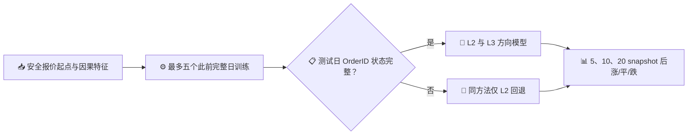

# 7709 L2/L3 涨跌方向预测实验

_截至 2026 年 9 月 24 日；2026 年 7 月逐日滚动测试。本文只评价方向预测，不把方向准确率等同于可实现收益。_

---

## 📌 技术摘要

- 对未来 **5 个 snapshot** 的非持平中价变化，19 个测试日的 L2 + 六个 L3 生命周期特征逻辑回归达到 **54.20%** 准确率、**0.5581** AUC；同口径仅 L2 为 53.68%，此前训练日多数类基线为 50.67%。5 个 snapshot 的实际时间跨度中位数约 0.63 秒。[方向基准](output/direction_benchmark_short_full/results.json)、[跨度时长](output/direction_dataset/horizon_duration.json)
- 在 10 个完整 L3 测试日，只用六个 OrderID 生命周期特征的逻辑回归达到 **54.70%** 准确率、**0.5666** AUC；仅 L2 逻辑回归为 53.41%。按交易日配对重抽样，差值为 **+1.29 个百分点**，95% 区间 **+0.65 至 +2.09 个百分点**，10 天中 9 天改善。[短期方向基准](output/direction_benchmark_short_full/results.json)、[配对比较](output/direction_benchmark/extra_comparisons.json)
- 20 个 snapshot 的最佳整月二分类结果为 L2 + L3 浅层梯度提升树：**52.89%** 准确率、**0.5399** AUC。L3 增量和可预测性都随预测跨度增大而减弱。[20-snapshot 基准](output/direction_benchmark/results.json)
- 这些成绩仍然较弱。二分类准确率只在事后确认“未来确有涨跌”的样本上统计；5-snapshot 目标中 **17.78%** 为持平。包含持平的三分类在全部报价上准确率 **44.67%**，对持平的召回率只有 **14.64%**。7 月日期已经被反复检视，模型选择还没有新的完整 L3 日期验证。[三分类结果](output/direction_three_way/results.json)

## 🔬 标签、数据与无前视流程

固定使用此前回测的 20 个 7 月交易日及相同的安全报价起点。7 月 2 日只提供先前训练数据；7 月 3 日至 30 日的 19 天为逐日向前测试，共 99,394 个报价起点。10 个测试日的 OrderID 重建完整，可评价 L3；9 个有记录断流或订单错误的日子严格回退到同方法的 L2 预测。[方向数据清单](output/direction_dataset/manifest.json)、[回退验证](output/direction_benchmark/validation.json)

标签为同一重建片段内的未来中价减当前中价，以当日 tick 表示并四舍五入到半 tick，再取负、零、正。主指标只在非零标签上计算上涨/下跌准确率、平衡准确率和 AUC；零标签的比例单独报告。训练与测试共用相同报价起点，因此不同跨度的比较不靠更换测试样本取得。[数据构建代码](build_direction_dataset.py)

| 预测跨度 | 对应时间中位数 | 非持平样本 | 持平占全部报价 |
| ---: | ---: | ---: | ---: |
| 5 snapshot | 0.63 秒 | 81,720 | 17.78% |
| 10 snapshot | 1.29 秒 | 87,471 | 12.00% |
| 20 snapshot | 2.61 秒 | 91,316 | 8.13% |

时间跨度来自这些测试报价起点与对应未来 snapshot 的实际时间差。[跨度时长诊断](output/direction_dataset/horizon_duration.json)

输入包含冻结的 64 维 DeepLOB 表征、28 个因果 L2 特征，以及在完整 MBO 日可用的六个 L3 特征。每个测试日最多用此前五个完整 MBO 日训练；所有逻辑回归、线性 SVM、Ridge 取符号、浅层梯度提升树及标签变体的超参数在本轮回放开始前固定。[完整方法](benchmark_direction_methods.py)、[L3 特征实现](l3_order_signal.py)

## 📊 多方法对比：短期方向更可预测

下表是 19 个测试日所有非持平样本的整体准确率；L3 模型在 9 个不完整日使用同方法 L2 回退。多数类基线根据此前训练日的涨跌比例决定方向，microprice 基线使用当下盘口的微观价格偏离。[5/10-snapshot 结果](output/direction_benchmark_short_full/results.json)、[20-snapshot 结果](output/direction_benchmark/results.json)

| 方法 | 5 snapshot | 10 snapshot | 20 snapshot |
| --- | ---: | ---: | ---: |
| 此前训练日多数类 | 50.67% | 50.60% | 50.86% |
| Microprice 符号 | 53.69% | 52.78% | 52.07% |
| 仅 L2：Ridge 数值回归取符号 | 53.40% | 52.75% | 52.45% |
| 仅 L2：逻辑回归 | 53.68% | 52.78% | 52.45% |
| L2 + 六个 L3：逻辑回归 | **54.20%** | 53.30% | 52.74% |
| L2 + 六个 L3：线性 SVM | 54.20% | 53.27% | 52.73% |
| L2 + 六个 L3：浅层梯度提升树 | 54.14% | **53.53%** | **52.89%** |

5-snapshot 逻辑回归的平衡准确率为 54.12%、AUC 为 0.5581；20-snapshot 树模型的平衡准确率为 52.73%、AUC 为 0.5399。多个模型得到相近的小幅增益，说明这一结果并非单靠某一个复杂分类器，但也远未达到高确定性的涨跌预测。[完整模型指标](output/direction_benchmark_short_full/results.json)、[20-snapshot 模型指标](output/direction_benchmark/results.json)

## 🧬 L3 单独建模：六特征比旧三特征更有用

在 10 个完整 L3 日比较相同报价，L3 特征本身已包含可测的短期方向信息。下表只列这些日子的非持平样本；L3-only 没有在断流日硬算结果。[完整日模型比较](output/direction_benchmark_short_full/results.json)、[配对交易日验证](output/direction_benchmark/extra_comparisons.json)

| 特征与分类器 | 5-snapshot 准确率 | 5-snapshot AUC | 20-snapshot 准确率 |
| --- | ---: | ---: | ---: |
| 仅 L2，逻辑回归 | 53.41% | 0.5459 | 52.20% |
| L2 + 旧三个 L3 特征，逻辑回归 | 54.13% | 0.5567 | 52.58% |
| L2 + 六个 L3 特征，逻辑回归 | 54.35% | 0.5591 | 52.71% |
| 仅六个 L3 特征，逻辑回归 | **54.70%** | **0.5666** | 52.82% |

5-snapshot 下，六特征 L3-only 相比仅 L2 的配对准确率提高 **1.29 个百分点**（10 天中 9 天为正）；相比 L2 + L3 六特征只高 0.35 个百分点，其交易日 bootstrap 区间跨越零。它是最值得继续验证的简单候选，并不能据此认定丢掉 L2 一定更好。[配对比较](output/direction_benchmark/extra_comparisons.json)

逐个单独使用 L3 特征做 5-snapshot 逻辑回归，最佳的是最优价**订单数量不平衡**，其次为近 5 秒**订单移除次数差**。下表的准确率均来自同一 10 个完整 L3 日；单因子结果不是加入其他因子后的独立贡献。[L3 消融](output/direction_l3_ablation/results.json)

| L3 输入 | 非持平涨跌准确率 | AUC |
| --- | ---: | ---: |
| 六个生命周期特征一起 | **54.70%** | **0.5666** |
| 最优价订单数量不平衡 | 54.30% | 0.5588 |
| 近 5 秒订单移除次数差 | 54.14% | 0.5525 |
| 最优价订单大小集中度差 | 53.90% | 0.5542 |
| 近 5 秒老订单移除量差 | 50.88% | 0.5124 |
| 最优价订单年龄对数差 | 50.62% | 0.5040 |
| 近 5 秒新挂单量占比差 | 50.59% | 0.5023 |

在 10 次滚动训练中，订单数量不平衡的标准化逻辑回归系数均为正；订单移除次数差的系数 9 次为正。年龄差单独分类接近随机，但在六特征模型中的系数方向稳定，因此不能仅凭单因子准确率把它判定为无用。[滚动系数检查](output/direction_l3_ablation/coefficient_stability.json)

## 🧪 不同标签与三分类的核查

仅对过去绝对变动至少 1 tick 的样本训练，5-snapshot 的 L2 + L3 六特征逻辑回归准确率为 54.19%，与标准训练的 54.20% 基本相同；按过去变动幅度加权训练为 53.90%。10 和 20 snapshot 也没有稳定优势。单纯扩大方向标签幅度或给大波动更高权重，目前不能解决弱信号问题。[标签训练变体](output/direction_label_variants/results.json)

主表的二分类分母只包括未来非持平报价，实际部署时无法提前知道哪次会持平。包含全部报价的“涨、平、跌”逻辑回归在 5 snapshot 下如下；持平占全部报价 17.78%。[三分类结果](output/direction_three_way/results.json)、[三分类配对验证](output/direction_three_way/validation.json)

| 5-snapshot 三分类 | 全报价准确率 | 宏平均 F1 | 持平召回率 |
| --- | ---: | ---: | ---: |
| 仅 L2，无类别权重 | 44.22% | 0.3855 | 14.75% |
| L2 + L3 六特征，无类别权重 | **44.67%** | **0.3887** | 14.64% |
| L2 + L3 六特征，类别平衡权重 | 37.52% | 0.3712 | 51.37% |

加大持平类别权重能找回更多持平，却把大量涨跌误判为持平；20-snapshot 无权重模型的持平召回率更低，约 0.45%。5-snapshot 三分类加入 L3 的全报价准确率增加 **0.45 个百分点**，但绝对表现仍不足以形成可靠的“何时该交易”规则。[三分类配对验证](output/direction_three_way/validation.json)

## ⚠️ 结论边界与下一步

方向指标已有可重复的小幅改善，尤其在完整 L3 日的 5-snapshot 目标上；最强的可解释信号来自 OrderID 层面的订单数量与移除事件。相较此前直接回归 20-snapshot 中价数值，这项实验更清楚地测到了短期排序信息。

这些结果仍有三项关键限制：

1. **同一批 7 月日期已用于方法比较。** 交易日 bootstrap 区间未对多种模型、标签和跨度的选择作校正；需要冻结候选后，用新的完整 L3 日期验证。
2. **条件准确率不是可交易胜率。** 5-snapshot 非持平样本占全部报价 82.22%；持平与错误方向都可能在真实报价中出现，三分类对持平仍弱。
3. **方向不等于净收益。** 5 snapshot 中位仅 0.63 秒，还要考虑信号计算、报价、成交队列、手续费和随后平仓。此前完整月度做市回放仍为净亏损。[做市报告](NEW_HYBRID_JULY_REPORT.md)

建议固定两个候选：**L3 六特征逻辑回归**与 **L2 + L3 六特征逻辑回归**，优先评价 5-snapshot 涨跌、三分类和概率校准；在新完整 MBO 日期上通过后，再将概率转为按报价侧和成交条件划分的预期净收益，重求 QVI 并核对净收益。现在不宜把 54% 左右的条件准确率直接用于实盘报价。

## 🔗 结果与复现

| 任务 | 代码 | 结果 |
| --- | --- | --- |
| 特征与标签缓存 | [build_direction_dataset.py](build_direction_dataset.py) | [数据清单](output/direction_dataset/manifest.json) |
| Snapshot 对应时间 | [diagnose_direction_horizon_seconds.py](diagnose_direction_horizon_seconds.py) | [时长诊断](output/direction_dataset/horizon_duration.json) |
| 线性、SVM、树与跨度比较 | [benchmark_direction_methods.py](benchmark_direction_methods.py) | [5/10-snapshot](output/direction_benchmark_short_full/results.json)、[20-snapshot](output/direction_benchmark/results.json) |
| 训练标签变体 | [benchmark_direction_label_variants.py](benchmark_direction_label_variants.py) | [变体结果](output/direction_label_variants/results.json) |
| L3 单因子消融 | [ablate_l3_direction_features.py](ablate_l3_direction_features.py) | [消融结果](output/direction_l3_ablation/results.json) |
| 涨平跌三分类 | [benchmark_three_way_direction.py](benchmark_three_way_direction.py) | [三分类结果](output/direction_three_way/results.json) |
| 前视、回退与交易日配对检查 | [validate_direction_benchmark.py](validate_direction_benchmark.py)、[compare_direction_variants.py](compare_direction_variants.py)、[validate_three_way_direction.py](validate_three_way_direction.py) | [二分类验证](output/direction_benchmark/validation.json)、[额外配对比较](output/direction_benchmark/extra_comparisons.json)、[三分类验证](output/direction_three_way/validation.json) |

同一未来中价标签下的 DeepLOB 表征、旧 Hybrid 特征、L3 特征对照，以及 AS/GP 做市结果，见[统一标签与做市报告](../0920report/README.md)。
