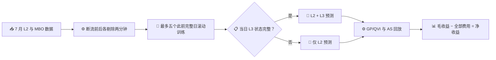

# 7709 New Hybrid：2026 年 7 月预测与做市回测总结

_截至 2026 年 9 月 24 日；基于仓库内保存的逐日回放结果。金额单位为港元。_

---

## 📌 结论摘要

- 将三个依赖 OrderID 的 L3 生命周期特征加入 L2 + DeepLOB 后，在可使用 L3 的 10 个测试日，未来 20 个 snapshot 中价变化的 RMSE 从 3.4626 降至 3.4606 tick，相关系数从 0.0347 升至 0.0432。但始终预测中价不变的简单基线 RMSE 为 **3.4551 tick**，优于两种训练模型。L3 相对 L2 的 MSE 改善 95% 交易日 bootstrap 区间为 **-0.025% 至 0.360%**，包含零。[预测结果](output/new_hybrid_signal/results.json)、[预测验证](output/new_hybrid_month/validation.json)、[零预测对照](output/new_hybrid_signal/zero_baseline_diagnostic.json)
- GP/QVI 加入 New Hybrid drift 后，按原始跨断流持仓口径，γ=3.125 的整月净收益为 through **-447.61**、touch **-2,771.13**；同 γ 的无 drift GP 分别为 -113.51 和 -2,386.74。AS 加入 drift 后的整月净收益也为负。[月度回放](output/new_hybrid_month/results.json)
- γ 从 5 降至 0.0001 的 11 点扫描中，没有一个 New Hybrid GP 组合盈利。γ=0.0001 相比同 γ 无 drift 基线虽然改善，但 through 仍亏 **56,855.75**、touch 仍亏 **27,198.82**。[γ 扫描](output/new_hybrid_gamma_sweep/results.json)

**当前判断：这些回放结果不支持启用 drift 报价。** 7 月日期已用于观察和比较模型，尚无新的、未参与调参日期来验证上述选择。

## 🔬 数据与实验口径

20 个 2026 年 7 月交易日进入数据集：7 月 2 日只用于先前数据校准，7 月 3 日至 30 日的 19 天为逐日向前测试，共 99,394 个报价起点。其中 10 天的 MBO 重建完整、可计算 L3 特征，覆盖 55,663 个起点；另外 9 天有记录的断流或订单错误，覆盖 43,731 个起点，这些日子严格回退为仅 L2 预测。[信号结果](output/new_hybrid_signal/results.json)、[月度验证](output/new_hybrid_month/validation.json)

| 项目 | 设定 |
| --- | --- |
| 预测目标 | `(mid[t+20] - mid[t]) / 当日 tick`，连续数值而非离散分类标签 |
| 模型输入 | 冻结的 64 维 DeepLOB 表征 + 28 个因果 L2 特征；融合头另加最优价订单的加权年龄差、挂单年龄不超过 5 秒的挂单量占比差、订单大小集中度差 |
| 训练 | `StandardScaler` + `Ridge(alpha=1000)`；最多五个此前完整 MBO 日；预测截断于 ±3 tick |
| 执行 | 5 ms 延迟、20 个 snapshot 报价期限、100 股一手、through/touch 两种成交代理，计入 maker 与市价平仓的全部费用 |
| GP 控制 | 最大持仓 10 手；γ 为每手平方每秒的库存惩罚系数，扫描 5 至 0.0001 |
| AS 控制 | 最大持仓 5 手；风险厌恶参数保持 0.02 per tick，不参与本次 GP γ 扫描 |

L3 特征要求可追踪 OrderID，并在每个报价时间核对重建盘口与 L2 最优价及数量。断流之后无法可靠恢复未知订单的年龄和集中度，因此 9 个受影响测试日整日不用 L3；这项保守处理比仅删除断流附近样本更严格。[特征实现](l3_order_signal.py)、[融合信号实现](build_new_hybrid_signal.py)

## 📈 中价预测：相对 L2 略有改善，但未胜过零预测

下表是对未来 20 个 snapshot 中价变化的逐报价汇总；RMSE 越低越好，相关系数越高越好。“零预测”指每次都预测未来中价变化为 0，其 RMSE 从相同测试报价的真实标签直接计算。L3 不可用日的两种训练模型预测完全相同。[预测结果](output/new_hybrid_signal/results.json)、[零预测对照](output/new_hybrid_signal/zero_baseline_diagnostic.json)

| 测试范围 | 模型 | 报价起点 | 相关系数 | RMSE（tick） |
| --- | --- | ---: | ---: | ---: |
| 19 天全部 | 零预测 | 99,394 | — | **3.58067** |
| 19 天全部 | 仅 L2 | 99,394 | 0.04366 | 3.58411 |
| 19 天全部 | New Hybrid | 99,394 | 0.04806 | 3.58302 |
| 10 个完整 L3 日 | 零预测 | 55,663 | — | **3.45514** |
| 10 个完整 L3 日 | 仅 L2 | 55,663 | 0.03472 | 3.46261 |
| 10 个完整 L3 日 | New Hybrid | 55,663 | 0.04321 | 3.46061 |

完整 L3 日相对仅 L2 的均方误差下降 **0.115%**，但相对零预测反而上升 **0.317%**。真实 20-snapshot 中价变化的标准差约 3.455 tick，而 New Hybrid 预测值的标准差仅约 0.395 tick：模型大多预测接近零，相关系数也只有 0.0432。约 37% 的真实变化绝对值达到至少 3 tick；这些日期的 tick 均为 HK$0.02，3.4606 tick 的 RMSE 对应每股约 HK$0.069 的价格预测误差，明显大于报价时约 1 tick 的中位买卖价差。RMSE 不是每笔成交的实际亏损。三个 L3 特征可能含有弱信息，但当前回归头尚未把它转成优于零预测的点预测，更没有转成正净收益。[预测验证](output/new_hybrid_month/validation.json)、[零预测对照](output/new_hybrid_signal/zero_baseline_diagnostic.json)

## 💰 原始月度回放：加入 drift 后仍亏损

下表沿用跨断流持仓的原始回放口径。比较均使用同一成交代理、数据与费用规则；“仅 L2 drift”与 New Hybrid 的差额才是 L3 的边际影响。[月度回放](output/new_hybrid_month/results.json)

| 控制器 | 成交代理 | γ | 无 drift 净收益 | 仅 L2 drift 净收益 | New Hybrid 净收益 |
| --- | --- | ---: | ---: | ---: | ---: |
| AS | through | — | -336,870.16 | -335,815.67 | -335,798.62 |
| AS | touch | — | -216,523.89 | -210,189.68 | -207,592.85 |
| GP/QVI | through | 5 | -119.54 | -475.91 | -472.17 |
| GP/QVI | touch | 5 | -2,439.69 | -2,921.58 | -2,857.73 |
| GP/QVI | through | 3.125 | -113.51 | -458.68 | -447.61 |
| GP/QVI | touch | 3.125 | -2,386.74 | -2,842.60 | -2,771.13 |

AS 的交易量与亏损量级远高于 GP；两者的 γ 定义和单位不同，不能把 GP 扫描直接套用到 AS。对记录的断流边界进行事后强制平仓只作为敏感性检查：γ=5 和 3.125 的 GP 结果未变化，AS 结果虽改善但仍大幅亏损。[强制平仓结果](output/new_hybrid_month_forced_flat/results.json)

## 📉 γ 扫描：降低库存惩罚放大交易与亏损

下表给出 19 天 New Hybrid GP 的净收益。γ 是 QVI 优化中的库存惩罚，**不是额外扣除的回测费用**；降低 γ 允许模型承担更多持仓和交易。[完整扫描及逐日结果](output/new_hybrid_gamma_sweep/results.json)、[逐日 CSV](output/new_hybrid_gamma_sweep/daily.csv)

| γ | through 净收益 | through maker 成交 | touch 净收益 | touch maker 成交 |
| ---: | ---: | ---: | ---: | ---: |
| 5 | -472.17 | 281 | -2,857.73 | 1,195 |
| **3.125** | **-447.61** | **278** | **-2,771.13** | **1,192** |
| 1 | -1,881.68 | 542 | -19,111.22 | 7,664 |
| 0.3 | -29,321.29 | 4,875 | -25,901.32 | 17,163 |
| 0.1 | -48,892.84 | 11,193 | -42,390.83 | 24,503 |
| 0.03 | -76,100.46 | 17,885 | -49,321.06 | 28,497 |
| 0.01 | -84,066.74 | 19,915 | -61,208.07 | 34,106 |
| 0.003 | -96,174.75 | 23,645 | -61,159.04 | 36,170 |
| 0.001 | -86,253.83 | 23,317 | -49,311.79 | 36,202 |
| 0.0003 | -60,771.09 | 20,976 | -31,818.36 | 34,370 |
| 0.0001 | -56,855.75 | 20,836 | -27,198.82 | 33,208 |

亏损随 γ 并非严格单调，因为 QVI 报价动作、实际成交与库存路径会跳变。但所有扫描点都为负。γ=0.0001 时，through 的毛收益 **-15,848.40**、全部费用 **41,007.35**；touch 的毛收益 **37,212.55**、全部费用 **64,411.38**。前者在费用前已亏，后者的正毛收益不足以支付费用。已知断流边界处强制平仓后，同 γ 两种净收益仍为 -48,384.86 和 -19,083.38。[扫描结果](output/new_hybrid_gamma_sweep/results.json)

## 🧬 L3 的边际收益与归因

同一 γ 下对比 New Hybrid 与仅 L2 drift，才能分离订单生命周期特征的贡献。以下是 19 天净收益差额；9 个 L3 不可用日的差额严格为零，因此所有差额来自 10 个完整 L3 日。[L3 边际对照](output/new_hybrid_gamma_sweep/l3_marginal.json)

| GP γ | through：New Hybrid − 仅 L2 | touch：New Hybrid − 仅 L2 |
| ---: | ---: | ---: |
| 5 | +3.73 | +63.85 |
| 3.125 | +11.08 | +71.46 |
| 1 | +75.16 | -26.63 |
| 0.3 | +23.19 | -86.26 |
| 0.0001 | +4,074.33 | -287.74 |

γ=0.0001 的 through 增量中，7 月 30 日单日贡献约 **3,765.3**，占合计增量的约 **92%**；其余日期有正有负。它不能证明 L3 在该 γ 下稳定改善做市收益，更不能将相对无 drift 基线的数万港元改善全部归给 L3。即使取这一正增量，整月 New Hybrid 仍然亏损。[L3 逐日对照](output/new_hybrid_gamma_sweep/l3_marginal.json)

## ⚠️ 证据限制与下一步

1. **没有新的独立测试日期。** 这 19 天已经用于模型比较和 γ 扫描；最佳 γ=3.125 只是这些日期上的探索结果。必须在新日期上固定参数再验证。
2. **成交仍是代理回放。** through 与 touch 是不同的成交假设，历史 OrderID 特征也没有直接提供本策略订单的真实排队位置与实盘成交。强制在断流边界平仓使用事后已知边界，只能作敏感性检查。
3. **预测目标与交易目标不一致。** 当前回归头学习 20 个 snapshot 后的中价变化；它并未直接学习“在给定报价侧、价格和成交条件下，扣除手续费及平仓成本的预期净收益”。这与毛收益、手续费和成交路径的结果一致，是下一版应优先验证的建模方向，而非已经确认的唯一亏损原因。

下一步应先把零预测设为中价预测的最低验收基线；再按报价侧、价格与成交条件构建预期净收益标签，在此前完整交易日上滚动训练并校准，重新求解 QVI。随后冻结模型与 γ，在新日期上同时检查预测质量、成交后的净收益、库存和完整回测结果。当前不建议上线 drift 报价。

## 🔗 复现与对账

| 内容 | 文件 |
| --- | --- |
| L2 + L3 信号训练和预测 | [build_new_hybrid_signal.py](build_new_hybrid_signal.py)、[信号结果](output/new_hybrid_signal/results.json) |
| RMSE 与零预测对照 | [diagnose_new_hybrid_rmse.py](diagnose_new_hybrid_rmse.py)、[诊断结果](output/new_hybrid_signal/zero_baseline_diagnostic.json) |
| 原始 AS/GP 月度回放 | [run_new_hybrid_month.py](run_new_hybrid_month.py)、[月度结果](output/new_hybrid_month/results.json) |
| GP γ 扫描与聚合 | [sweep_new_hybrid_gamma.py](sweep_new_hybrid_gamma.py)、[finalize_new_hybrid_gamma.py](finalize_new_hybrid_gamma.py)、[扫描结果](output/new_hybrid_gamma_sweep/results.json) |
| L3 边际归因 | [evaluate_new_hybrid_l3_gamma_marginal.py](evaluate_new_hybrid_l3_gamma_marginal.py)、[边际结果](output/new_hybrid_gamma_sweep/l3_marginal.json) |
| 对账检查 | [validate_new_hybrid.py](validate_new_hybrid.py)、[validate_new_hybrid_gamma.py](validate_new_hybrid_gamma.py)、[扫描验证](output/new_hybrid_gamma_sweep/validation.json) |

γ 扫描包含 11 个参数、19 天、2 种成交代理和 2 种断流持仓处理，共 836 条逐日结果；152 条旧 γ 锚点、1,672 项净收益/毛收益/费用恒等式和 924 项汇总检查通过。相关 GP 与断流单元测试共 18 项通过。[扫描验证](output/new_hybrid_gamma_sweep/validation.json)

后续针对涨跌方向的 5/10/20-snapshot 分类、六个 L3 特征消融和三分类核查，见[方向预测实验报告](DIRECTION_PREDICTION_REPORT.md)。
