# DeepLOB theory architecture

Source diagram for the architecture section in the reproduction report. Layer sizes and connections follow Figures 3 and 4 of the [DeepLOB paper](../pdf/DeepLOB_Deep_Convolutional_Neural_Networks_for_Limit_Order_Books.pdf).

---

## 📚 Model flow

```mermaid
flowchart LR
    accTitle: DeepLOB Model Architecture
    accDescr: DeepLOB transforms one hundred ten-level order-book states through structured convolutions, a multi-scale Inception module, an LSTM, and a three-class softmax output

    lob_input([📥 LOB input<br/>100 × 40]) --> conv_level_1[⚙️ 1×2 Conv@16 stride 1×2<br/>4×1 Conv@16 ×2]
    conv_level_1 --> conv_level_2[⚙️ 1×2 Conv@16 stride 1×2<br/>4×1 Conv@16 ×2]
    conv_level_2 --> conv_levels[⚙️ 1×10 Conv@16<br/>4×1 Conv@16 ×2]
    conv_levels --> inception[[🧠 Inception@32<br/>1×1→3×1 · 1×1→5×1<br/>3×1 MaxPool→1×1 · Concat]]
    inception --> lstm[🔄 LSTM@64]
    lstm --> softmax([📤 Softmax<br/>Down · Stationary · Up])

    classDef input_output fill:#dbeafe,stroke:#2563eb,stroke-width:2px,color:#1e3a5f
    classDef convolution fill:#ffedd5,stroke:#ea580c,stroke-width:2px,color:#7c2d12
    classDef temporal fill:#dcfce7,stroke:#16a34a,stroke-width:2px,color:#14532d

    class lob_input,softmax input_output
    class conv_level_1,conv_level_2,conv_levels convolution
    class inception,lstm temporal
```

CNN filters encode price-volume pairs, bid-ask structure, and interactions across levels. The Inception branches cover several temporal receptive fields, while the LSTM carries longer dependence into the three-class softmax output.
